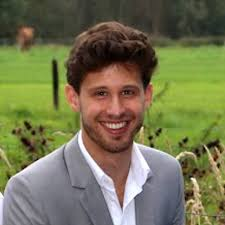

# Principal Investigator

## Ili Ma

I aim to understand the processes that underlie how adolescents form beliefs and how these guide their decisions. My approach includes (Bayesian) computational modelling of behavioral data. I am particularly interested in adolescents' susceptiblity to misinformation and the affective, social, and cognitive processes that potentially shape false beliefs. 

I am an assistant professor at Leiden University since November 2020. I am committed to providing a supportive, inclusive, and collaborative environment for the members of my lab. I joined the faculty council since September 2024 where I advocate for sustainable practices in research, education, and learning enviornments for students.

# PhD students
## ??

We are looking for a PhD candidate to join our team! The project will be focussed on susceptibility to misinformation and online risk taking in young adults. Contact Ili for information!

## Selin Topel

Selin is interested in how uncertainty drives learning and decision-making processes and how this might be affected by anxiety. She approaches this important topic from different perspectives, using behavioral experiments and computational models.

# Research master students

## Jaime Vigil

Jaime is deeply interested in cognitive computational modelling of social decision-making. His project focusses on how adolescents learn about other people's latent motives that drive their social decisions. He uses a series of behavioral economic games and computational models to understand this process.

## Chiara Migliore

Chiara joined the CODE lab for her Research Master apprenticeship. She is designing a new experiment to test social influence effects on misinformation susceptibility in adults.

# Research Assistants

## Daniël de Beer

Daniël is a Master's student in clinical child and adolescent psychology. His work focusses on identifying risk factors that make some individuals more susceptible to misinformation than others. He enjoys working with people and organizes interviews and focus groups with parents, young adults and police to strengthens his research.

## Lyuba Nicheva

Lyuba studies political sciences and aims to combine this field with insights from developmental psychology. Her work focusses on compiling and annotating a large database of true and false information and to use this in behavioral experiments of misinformation susceptibility.

## Lea Pagani

Lea is a third year Psychology bachelors student at Leiden University. She works on the SMART project (Social Media Misinformation Adolescence and Risk Taking). Her work focusses on compiling and annotating a large database of true and false information that will be used to in behavioral experiments to measure susceptibility to misinformation.

