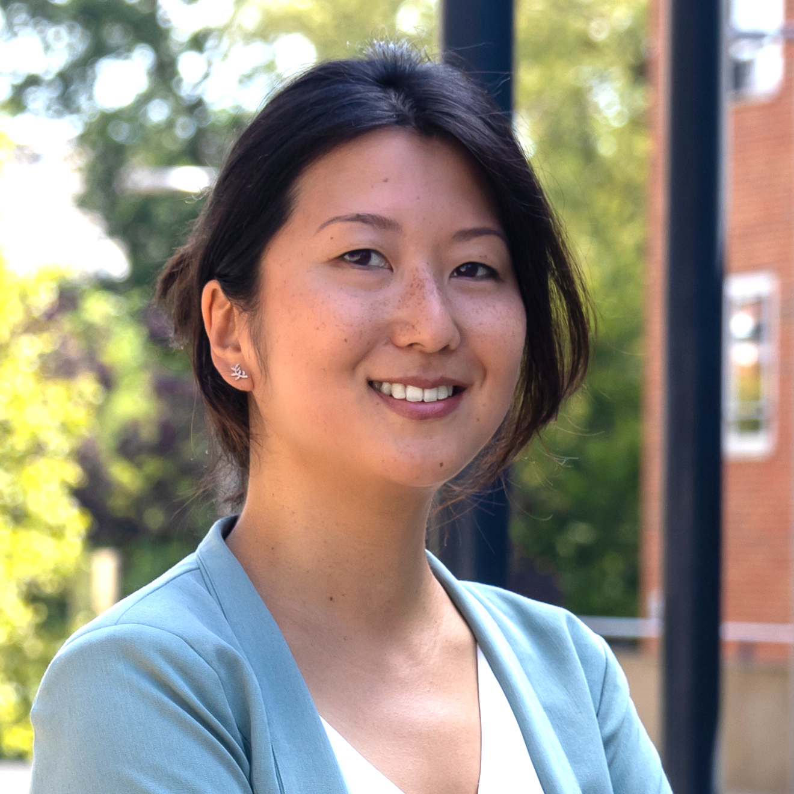
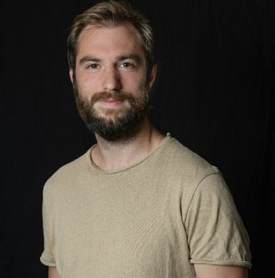
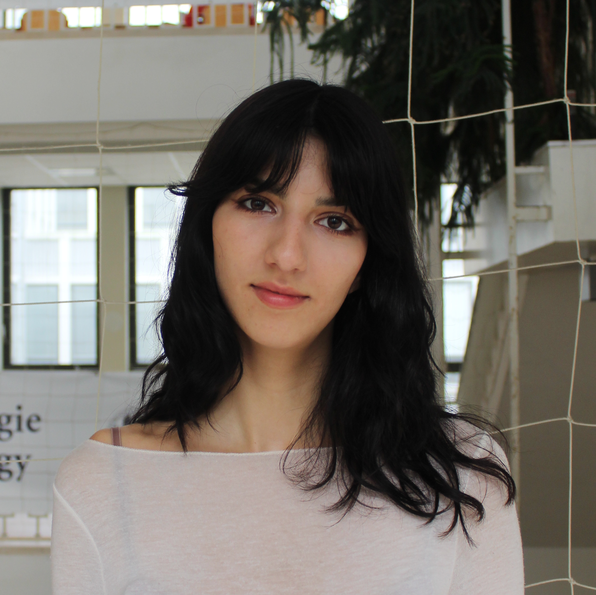

# Principal Investigator

## Ili Ma

I am an assistant professor at Leiden University. My research aims to understand the processes that underlie how adolescents form beliefs and how these guide their decisions. I am particularly interested in adolescents' susceptiblity to disinformation and the affective, social, and cognitive processes that shape false beliefs. I am committed to providing a supportive, inclusive, and collaborative environment for the members of my lab. As a member of the faculty council, I advocate for sustainable practices in research and education, and supportive learning environments for students.

## We'll be hiring soon!
We will soon have openings for two PhD candidates and one postdoc to join our team! The project is part of Ili's ERC Starting Grant focussed on characterizing adolescents' susceptibility to disinformation. Reach out to Ili for more info.

 

# PhD students

## Anne Snijders

Anne uses a multi-method approach to investigate adolescents' susceptibility to misinformation and their online risky decisions. This project contributes to understanding how social media shapes adolescent development in today's digital age. PhD co-advisors: Neeltje Blankenstein and Anna van Duijvenvoorde.

## Selin Topel

Selin is interested in how uncertainty drives learning and decision-making processes and how this might be affected by anxiety. She approaches this important topic from different perspectives, using behavioral experiments and computational models. PhD co-advisors: Anna van Duijvenvoorde, Henk van Steenbergen, and Ellen de Bruijn.

 
 

# Research master students
## Jaime Vigil

Jaime is deeply interested in cognitive computational modelling of social decision-making. His project focusses on how adolescents learn about other people's latent motives that drive their social decisions. He uses a series of behavioral economic games and computational models to understand this process.

## Mattan Helman

Mattan's project aims to characterize the relationship between uncertainty intolerance and conspiracy beliefs. He is also a founder of <a href = "https://www.refuser.org/">Refuser.org</a>.

## Zeren Konuksay

Zeren is interested in language processes and how they influence other aspects of cognition. Her project is uses Natural Language Processing to understand social media use.

 
 

# Research Assistants

## Sophie van Ooijen

Sophie is a second year bachelor's student in Psychology. She helps the lab with various projects.

 
 

# Alumni
#### Daniël de Beer
#### Lyuba Nicheva
#### Lea Pagani
#### Chiara Migliore